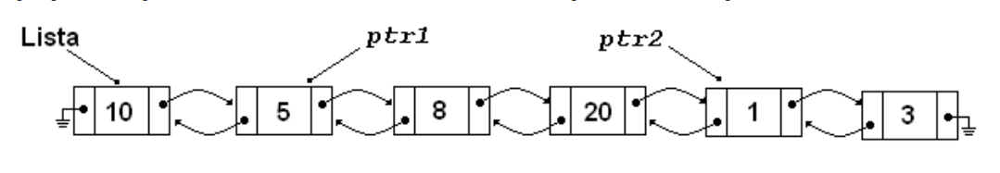

# Sanidade

Os Alunos de Algoritmos e Estruturas de Dados I, geralmente aprendem o conceito de listas encadeadas e durante o processo de aprendizado os professores, geralmente, pedem para que os alunos implementem as suas bibliotecas de listas encadeadas.

Um problema clássico nas listas é identificado quando os alunos implementam as listas duplamente encadeadas. Estas listas possuem apontadores para o próximo elemento e para o anterior. Geralmente as implementações dos alunos possuem alguns bugs e após algumas inserções e remoções a lista deixar de ficar sana, isto é, o caminho percorrido de um elemento qualquer PTR1 para outro elemento PTR2 deixa de ser o inverso do percurso de PTR2 para PTR1.

Figura 1: Exemplo de uma lista duplamente encadeada sana

Então para ajudar os alunos o professor definiu o problema da sanidade:

Dado dois ponteiros PTR1 e PTR2 pertencentes a uma lista duplamente encadeada, que:

* Estes ponteiros existem e não serão passados valores nulos;

* Podem estar em qualquer posição da lista;

* PTR1 vem ``antes’’ na lista, de PTR2;

* Pode existir qualquer quantidade de elementos antes de PTR1, depois de PTR2 e entre PTR1 e PTR2.

Um subconjunto de uma lista duplamente encadeada é dita sana quando o caminho de PTR1 a PTR2 é o inverso do caminho de PTR2 a PTR1.

Para ajudar a identificar listas insanas, o professor fez um patch no Valgrind fazendo um dump da memória pertinente a lista encadeada, ou seja, com que todos os elementos da lista encadeada fossem impressos na tela contendo o endereço daquele elemento e os ponteiros para o próximo e anterior.

Infelizmente o professor já gastou muito tempo implementando o patch e precisa de sua ajuda para implementar um programa que leia o dump da lista duplamente encadeada e diga se a lista está sana ou não.

## Entrada
---
A entrada é composta por um único caso de teste, contendo o dump da lista encadeada de um aluno. A entrada possui diversas linhas. Cada linha possui 3 números inteiros em formato hexadecimal representando, respectivamente, o endereço do elemento, o endereço do elemento anterior e o endereço do próximo elemento. O endereço 0 representa NULL.

As duas primeiras linhas do caso de teste representam os ponteiros de PTR1 e PTR2.

Nem todos os ponteiros fornecidos na entrada precisam, necessariamente, fazer parte do caminho PTR1->PTR2.

Para representar os ponteiros utilize inteiro sem sinal de 64bits.

## Saída
---
A saída deverá conter uma única linha contendo a palavra sana, quando o caminho de PTR1 para PTR2 for o inverso de PTR2 para PTR1 e insana quando não.

## Exemplos
---

### Exemplo de entrada
---
    a 0 b
    f e 0
    e d f
    b a c
    c b d
    d c e

### Saída para o exemplo de entrada
---
    sana
### Exemplo de entrada
---
    facada dead babaca
    dead 0 facada
    babaca facada 0

### Saída para o exemplo de entrada
---
    insana

Author: Bruno Ribas